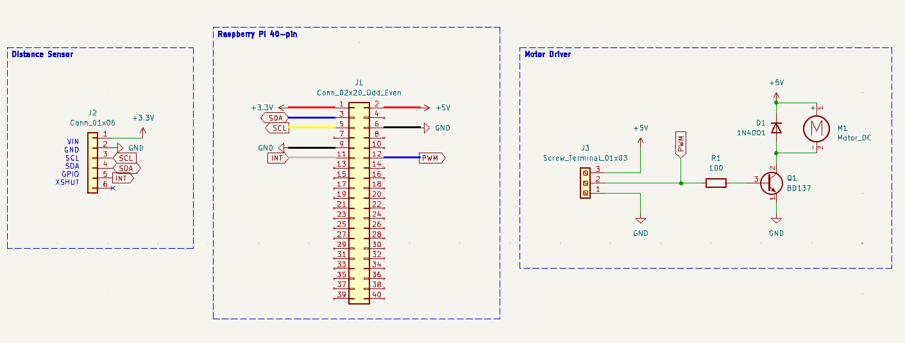
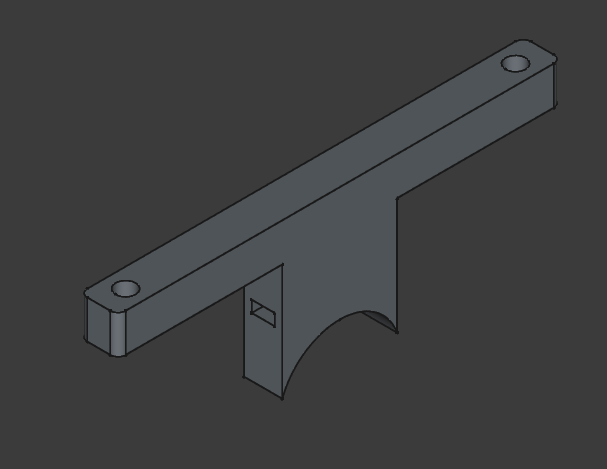
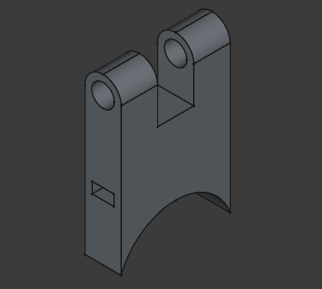
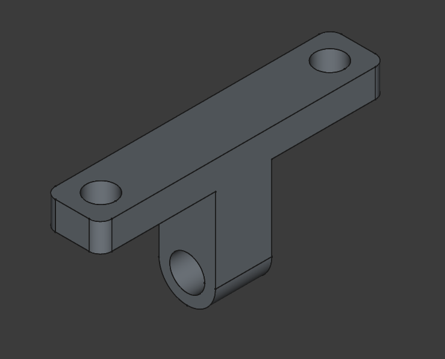

# Components

## Motor Driver

The chosen haptic feedback motor consumes around 80 mA of current at a voltage of 5V. Since the Raspberry Pi can only provide 16 mA per IO pin, an external motor driver is required. The driver consists of a simple low-side switching BJT driven by a PWM pin. Additionaly, a flyback diode is installed across the motor to avoid back-EMF.

## Schematics

## Battery 

To make the device portable, it should be battery-powered. To achieve this, the Waveshare UPS-HAT (B) is used. This module facilitates 2 18650 Li-ion batteries and provides various protection mechanisms including cell balancing, a charge controller, over-current and over-voltage protection, parameter monitoring, etc. The module uses the INA219 power monitoring chip, which can communicate the battery parameters over I2C through Pogo-pins connected to the underside of the Pi's 40-pin IO connector. The battery cells used are EVE INR 18650 3500 mAh cells, chosen for their higher capacity.

## Holders 

Holders for the Raspberry Pi and the ToF sensor were modelled using FreeCAD and printed with PLA filament. The printed pieces are attached to the Walking Stick with a ziptie fed through a slot in the printed part. Additionally, the ToF sensor holder allows adjusting the angle of the sensor. This is necessary because the detection angle of the sensor is around 27 degrees, and depending on how the stick is held, the distance to the ground could be picked up instead of the distance to an object in front of the device.

Raspberry Pi Holder (2 Pieces)

ToF Sensor Holder (Lower) 

ToF Sensor Holder (Upper) 