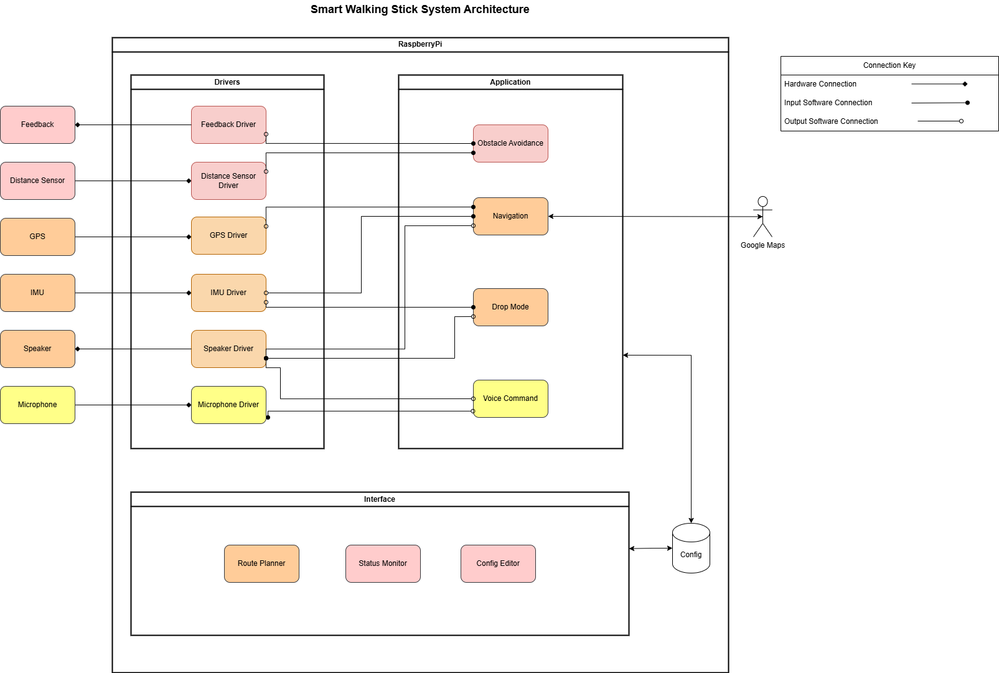

# System Archiecture

Below is a diagram of the initial system architecture designed:

## Hardware Components

- Feedback Module – Provides haptic or audio feedback to the user.
- Distance Sensor – Detects obstacles in the walking path.
- GPS Module – Tracks location for navigation.
- IMU (Inertial Measurement Unit) – Detects motion and orientation.
- Speaker – Provides auditory feedback and instructions.
- Microphone – Captures voice commands from the user.

## Software Layers

The system is structured into **Drivers**, **Application**, and an **Interface**.

### Drivers

Each hardware component has a dedicated driver that enables communication between the physical device and the software system. The connection symbol determines the flow of data.

### Application Layer

This is where the main logic of the smart walking stick is implemented:

- Obstacle Avoidance – Uses data from the distance sensor to help the user navigate around obstacles. User is notified using the haptic feedback sensor.
- Navigation – Uses GPS and IMU data for route planning and guidance, by integrating with Google Maps.
- Drop Mode – Detects if the stick is dropped using IMU data and triggers an alert via the speaker.
- Voice Command – Processes voice inputs for hands-free interaction.

### Interface Layer

This is allows the user to communicate with the application layer. This will be in the form of a web application which will send and recieve data via a config database.

- Route Planner – Allows users to set a destination, which will communicate with the navigation application.
- Status Monitor – Allows the user to monitor the health of the sensors.
 - Config Editor – Adjusts system settings of the applications and the sensors. 